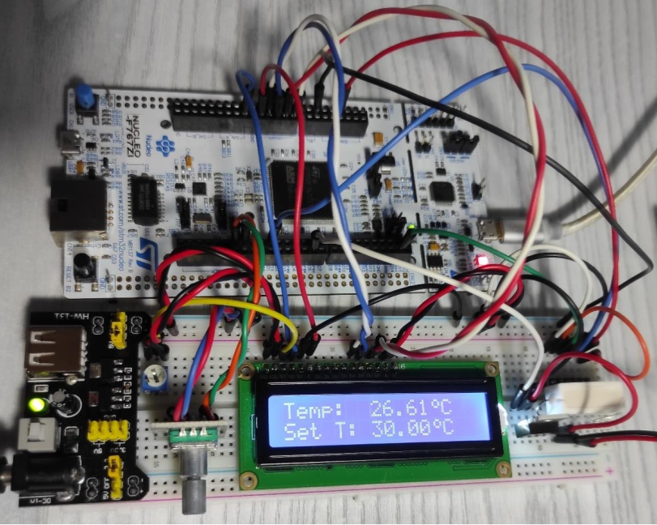
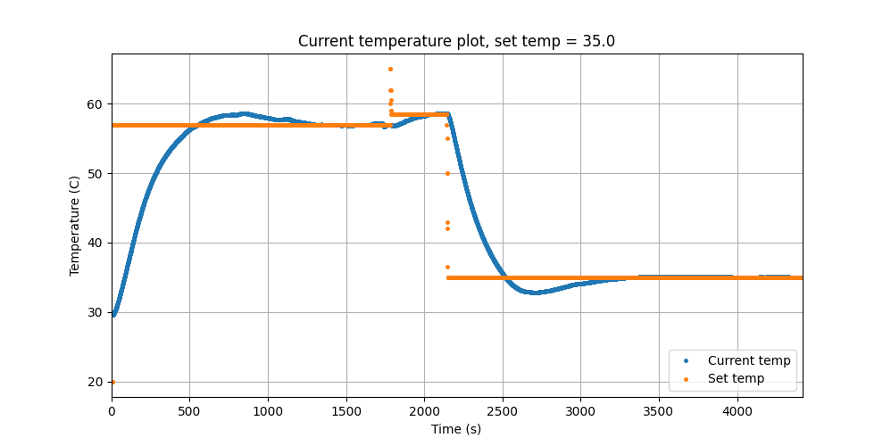

# PID controller project - resistor temperature control

Temperature controller with PID regulator and live data logger. Implemented on development board NUCLEO-STM32F767ZI.

## Features
- Temperature setting via UART serial communication or phisical encoder (default start temperature is 20℃)
- Monitoring current measured value via UART serial communication
- Display of setpoint and current temperature on LCD display
- Python script for logging live data and displaying measured signals on graph
- Automatic control system controlled by a software-designed PID controller

## Components
-	Development board NUCLEO-STM32F767ZI
-	Ceramic heating resistor 22Ω, 5W
-	Power supply AC/DC - 5,7V/800mA DC
-	Supply module for contact plates MB102
-	Transistor MOSFET IRF520N
-	Temperature sensor (digital - I2C) BMP280
-	Rotary encoder
- Display - LCD 1602A

## Electrical schematics
[Schematics](./Screens_pdfs_txts/Schematics.pdf)

## Photos

## Demonstration video
[Demo video on Youtube](https://youtu.be/86S8K2vb8bY)

## Resources:
- https://os.mbed.com/platforms/ST-Nucleo-F767ZI/
- https://msalamon.pl/dziecinnie-prosta-sprzetowa-obsluga-enkodera-na-stm32/
- https://www.electronics-tutorials.ws/pl/tranzystor/mosfet-jako-przelacznik.html
- https://msalamon.pl/dostalismy-swietna-obsluge-przerwania-uart-idle-w-halu/
-	https://matplotlib.org/stable/index.html
-	https://www.researchgate.net/profile/Chris_Cox6/publication/316658102_First_order_plus_dead_time_FOPDT_model_parameter_estimation/links/5b2275ed0f7e9b0e37423cf6/First-order-plus-dead-time-FOPDT-model-parameter-estimation
